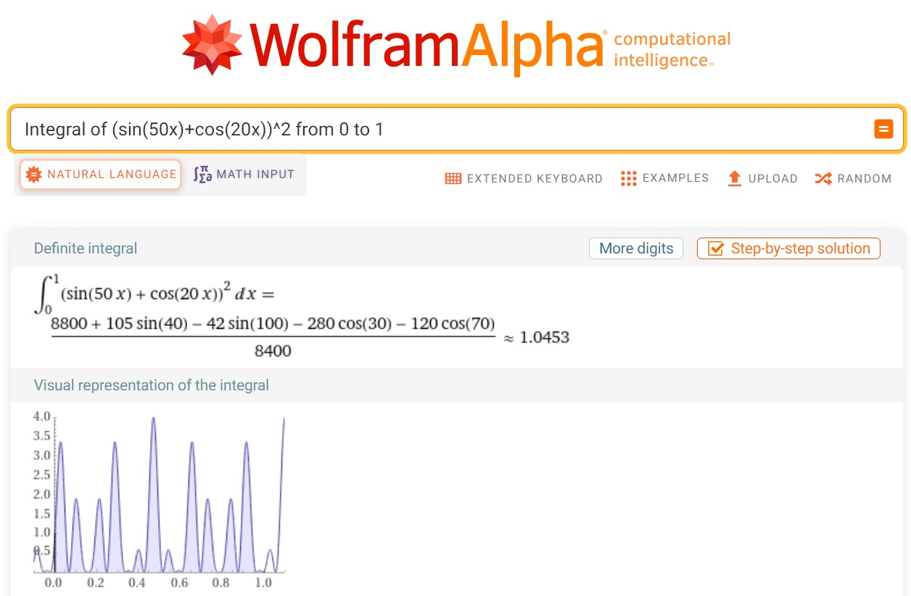

```{r setup, include=F}
knitr::opts_chunk$set(echo = T, fig.align = "center", fig.width = 7)
```

## The integration problem

How to solve the integral of $(sin(50x)+cos(20x))^2$ from 0 to 1
$$\int_0^1 [sin(50x)+cos(20x)]^2 dx$$

There are couple of ways we do it, for instance checking it online web, integrating it analytically, or using numerical method, or Monte Carlo method.

First, Let us ask the big boss of chat.GPT. It turns out a disaster:-)


Secondly, Let's try WolframAlpha online

- Copy "Integral of (sin(50x)+cos(20x))^2 from 0 to 1"
- Paste it into [WolframAlpha](https://www.wolframalpha.com/)
- The engine will translate it into a correct math integral, and give it back a number and a very nice visual representation of the integral



## Analytic method

This is the preferable method, but many integrals may be hard or even impossible. 

\begin{align*}
I  & = \int_0^1 [sin(50x)+cos(20x)]^2 \, dx\\
& =\int_0^1 [sin^2(50x)+cos^2(20x)+2sin(50x)cos(20x)]\, dx\\
& =\int_0^1 [\frac{1-cos(100x)}{2}+\frac{1+cos(40x)}{2}+sin(50x+20x)+sin(50x-20x)]\, dx\\
& =\left[\frac{1}{2}x-\frac{1}{2}\frac{sin(100x)}{100}+\frac{1}{2}x+\frac{1}{2}\frac{sin(40x)}{40}-\frac{cos(70x)}{70}-\frac{cos(30x)}{30}\right]_{x=0}^{x=1}\\
&= \left[x- 0.5 \frac{sin(100x)}{100}+0.5 \frac{sin(40x)}{40}-\frac{cos(70x)}{70}-\frac{cos(30x)}{30}\right]_{x=0}^{x=1}
\end{align*}

```{r}
f<- function(x) {
  x-0.5*sin(100*x)/100+0.5*sin(40*x)/40-cos(70*x)/70-cos(30*x)/30
}

f(1)-f(0)

```


## Numerical integration

### Trapezoidal rule programming by loop

```{r}
integrate_trapezoidal_1 <- function(f, a, b, n) {
  h <- (b - a) / n
  result <- (f(a) + f(b)) / 2
  for (i in 1:(n - 1)) {
    result <- result + f(a + i * h)
  }
  result <- result * h
  return(result)
}

myfn<- function(x)(sin(50*x)+cos(20*x))^2

integrate_trapezoidal_1(myfn,0,1,10000) 

```

### Trapezoidal rule probramming by vector

```{r}
# I can do it myself using vector programming instead of using for loop
integrate_trapezoidal_2<- function(myfn,a,b,n) {
  h<-(b-a)/n
  x.vec <- seq(a,b,by = h)
  f.vec <- sapply(x.vec, myfn) 
  A<- h*(f.vec[1]/2+sum(f.vec[2:n])+f.vec[n+1]/2)
  return(A)
}

myfn<- function(x)(sin(50*x)+cos(20*x))^2

integrate_trapezoidal_2(myfn,0,1,10000)
```

### Simpson's rule coding 1

```{r}
integrate_simpson<- function(myfn,a,b,n) {
  h<-(b-a)/n
  x.vec <- seq(a,b,by = h)
  f.vec <- sapply(x.vec, myfn) 
  sum<- f.vec[1]+f.vec[n+1]
  for (i in 2:n){
    if (i%%2 == 0)
      sum = sum + 4*f.vec[i] #f.vec[2] corresponding to f(x1)
    else 
      sum = sum + 2*f.vec[i] #f.vec[3] corresponding to f(x2)
  }
  sum = sum*h/3
  print(sum)
}

myfn<- function(x)(sin(50*x)+cos(20*x))^2

integrate_simpson(myfn,0,1,1000)
```

### Simpson's Rule coding 2
```{r}
integrate_simpson_2 <- function(f, a, b, n) {
  h <- (b - a) / n
  x <- seq(a, b, length.out = n + 1)
  y <- f(x)
  result <- h / 3 * (y[1] + 4 * sum(y[seq(2, n, 2)]) + 2 * sum(y[seq(3, n-1, 2)]) + y[n + 1])
  return(result)
}

myfn<- function(x)(sin(50*x)+cos(20*x))^2

integrate_simpson_2(myfn,0,1,1000)


```

### R built-in function of integrate

```{r}
integrate(function(x) (sin(50*x)+cos(20*x))^2, lower =0, upper = 1)
```

## Integration by Monte Carlo

1.  generate x1, x2,...xn from uniform(a, b)
2.  Compute h(x1), h(x2), ..., h(xn)
3.  Estimate E(h(X)), by averaging h(X)
4.  Estimate the integral I=(b-a)\* average of h(x)

Here h(x)= (sin(50x)+cos(20x))\^2

First define the function, and draw a visual representation of the integral

```{r}
x<- seq(0,1, by = 0.001)
h<- function(x)(sin(50*x)+cos(20*x))^2
plot(x,h(x), type="l")
```
Secondly, let's do it using Monte Carlo

```{r}
set.seed(1) 
n <-10^6 #Set the number of points to generate
x<-runif(n, 0,1) #generate n number of points from uniform (0,1)
h_x<- h(x)
hbar_x <- mean(h(x)) #compute h(x), and the mean of h(x)
(I = 1*hbar_x) #mean times the interval = integral
```

Third step, how much variation of the hbar_x becomes as we increase the number of n.
```{r}
n <- 10^4
hbar_n <-cumsum(h_x[1:n])/1:n # to compute cumulative mean of h(x)

#To estimate variance of hbar_m
var_m <- function(m){
  sum((h_x[1:m]-hbar_n[m])^2)/m^2
}

v_n <- apply(matrix(1:n),1,var_m)

se_n <- sqrt(v_n)

plot(1:n,hbar_n, type = "l")

lines(hbar_n+1.96*se_n, col = "blue")

lines(hbar_n-1.96*se_n, col = "blue")
```


library(mosaic)
shape <-5
rate <-1.5
bounds <-qgamma(c(.025,.975),shape,rate)
xpgamma(bounds,shape,rate)


3*0.5^2*0.5


